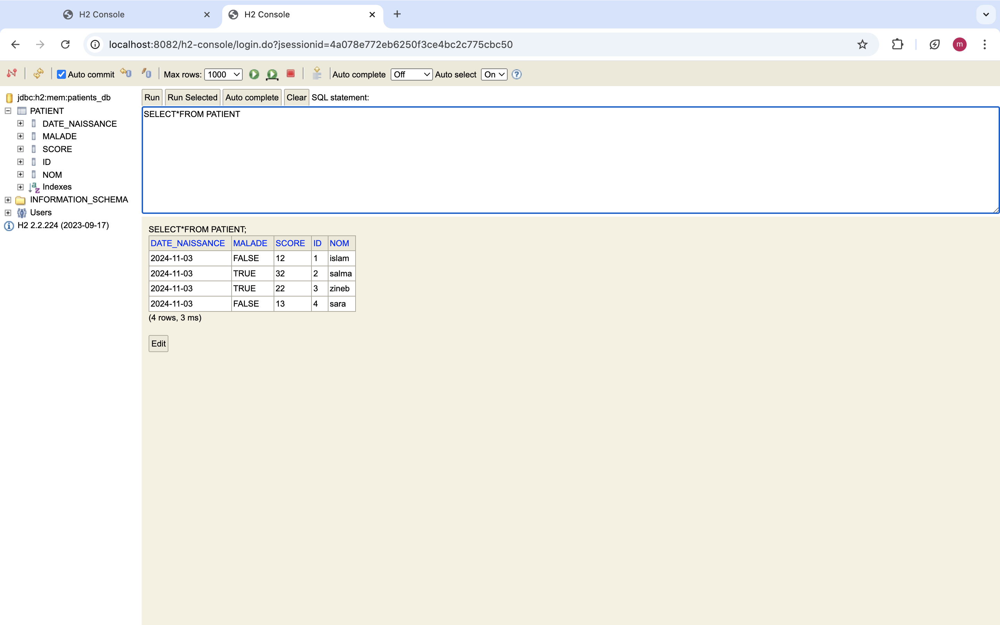
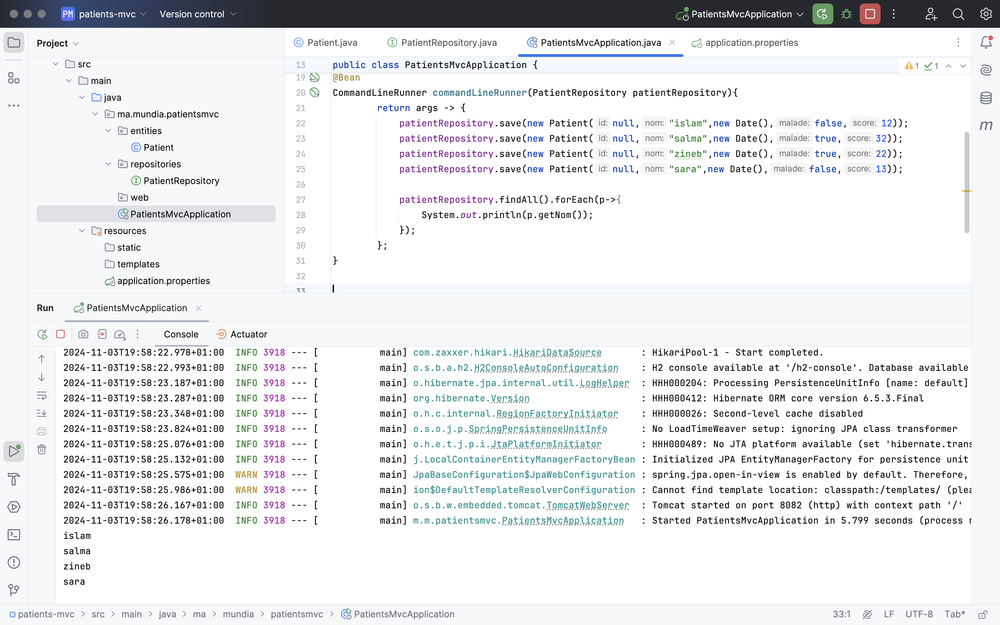
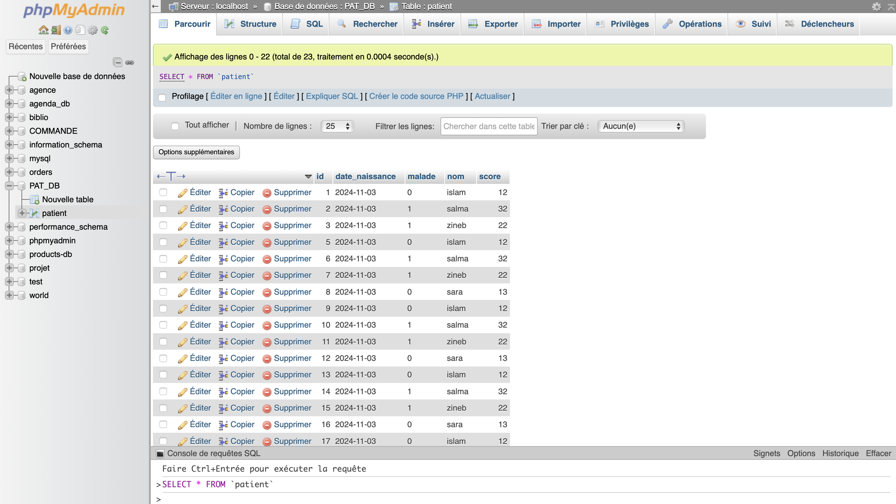
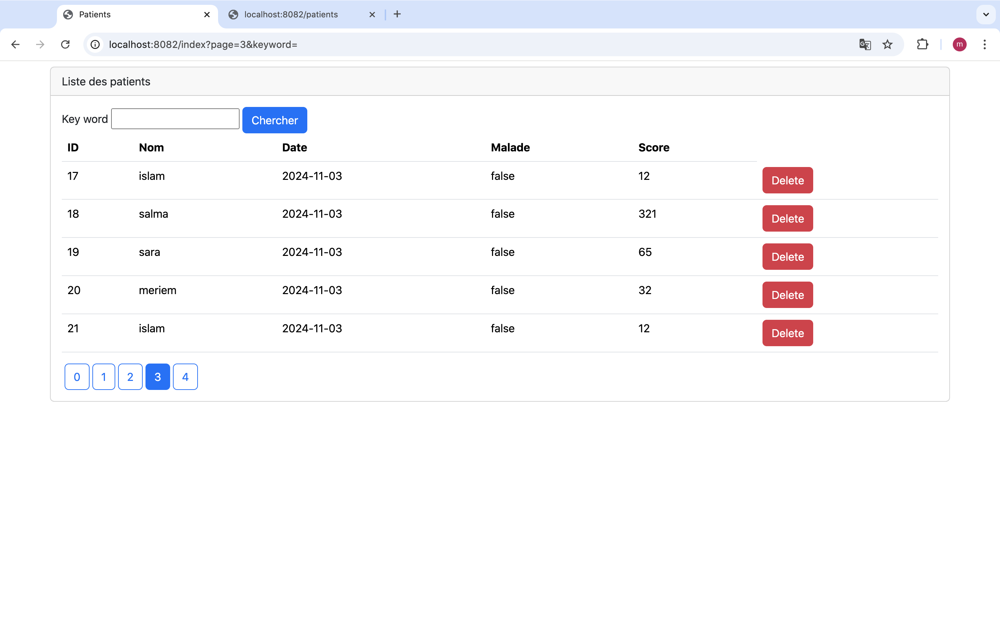
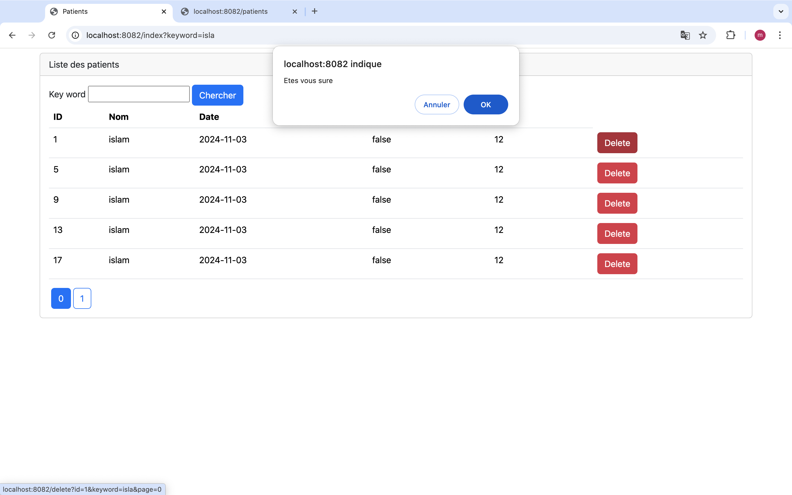
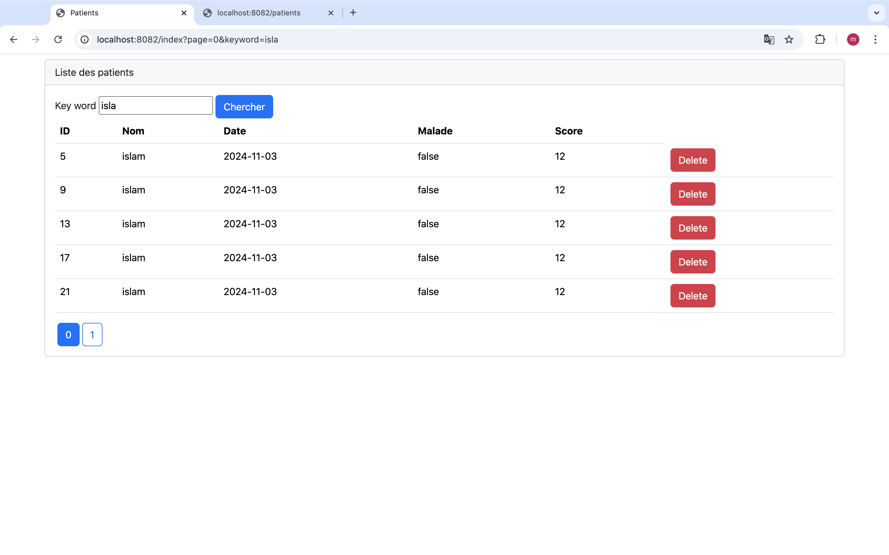
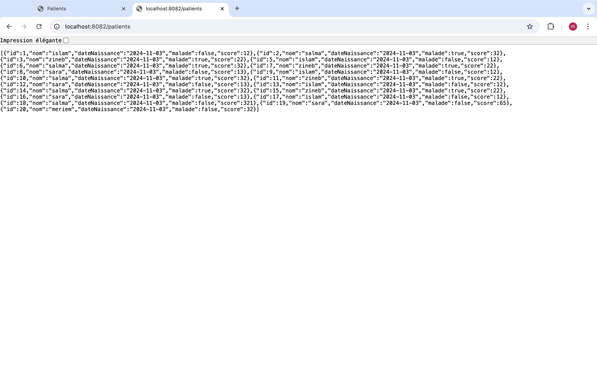

<h1> Rapport du TP4:  Gestion des Patients Spring MVC</h1>
<h2>Liste des patients affichée dans H2 Database Console :</h2>

<h2> L'affichage de liste complète des patients:</h2>

<h2> La création DB Patients sur phpMyAdmin :</h2>

<h2>Page d'acceuil de patients</h2>

<h2> Recherche des patients par mot-clé "islam"</h2>
<h2>Suppression d'un patient avec message de confirmation</h2>

<h2>Affichage sous format JSON: </h2>

